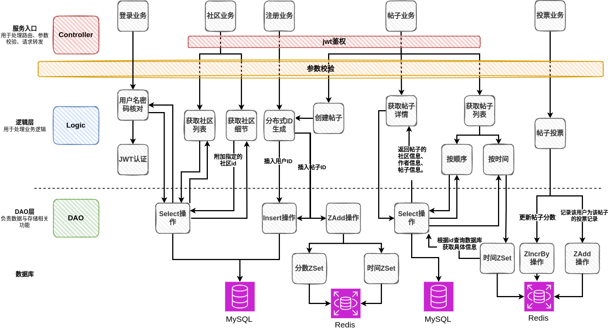

# bluebell:基于gin实现的博客论坛后端系统

---

## 流程图总览

&emsp;&emsp;本项目采用CLD分层结构实现了博客论坛后端系统的五个业务：注册业务、登录业务、社区业务、帖子业务、投票业务。

## 注册业务

  

* 1、首先客户端向服务端发送一个POST请求，POST请求中带有用户名和密码，并进行参数校验
* 2、然后通过用户名判断用户是否已经存在，若已存在则返回用户已存在错误
* 3、如果没问题的话则通过snowFlake库生成分布式ID，通过md5库对密码进行加密，然后将用户名、加密后的密码、分布式ID组成**用户记录**
* 4、将用户记录插入数据库

## 登录业务

  

* 1、客户端向服务端发送POST请求，请求中带有用户名和密码，并进行参数校验
* 2、通过查询数据库，判断数据库中是否存在用户且用户名和密码是否匹配
* 3、若查询到且匹配，则进行jwt的Token生成，否则，返回错误
* 4、将生成的Token返回给客户端，用于后续的鉴权

### jwt鉴权
在生成了AccessToken和RefreshToken并发送给客户端之后，现在客户端访问路由时需要带上Token来完成服务端的认证。

整个会话的流程如下：
* 客户端访问需要认证的接口时，携带AccessToken
* 如果AccessToken没有过期，则服务端鉴权后返回给客户端需要的数据
* 如果AccessToken过期，则客户端使用RefreshToken向服务端的刷新接口申请新的AccessToken
* 如果RefreshToken没有过期，则下发新的AccessToken
* 如果RefreshToken过期，则需要用户重新登录来获取新的AccessToken和RefreshToken

## 社区业务

### 功能1：查询所有社区信息
* 向"/community"路由发送GET请求来调用查询功能
* 通过sql的select语句查询community表中的community_id（社区ID）, community_name（社区名）两个字段来获取所有社区的简要信息。

### 功能2：查询某个社区的详细信息
* 向"/community/:id"路由发送GET请求，其中通过获取id值来查询指定社区的信息
* 通过sql的select语句查询community表中指定ID的community_id, community_name, introduction, create_time 字段来获取指定社区的详细信息。

## 帖子业务

### 功能1：创建帖子

### 功能2：获取指定帖子的详细信息

### 功能3：获取帖子列表

## 投票业务

&emsp;&emsp;对于投票业务，我们首先介绍其中用到的三种命名空间下的zset，以及其中的成员和分数对应信息
* KeyPostTimeZSet    = "bluebell:post:time:"  //zset;命名空间为帖子创建时间，帖子ID->时间
* KeyPostScoreZSet   = "bluebell:post:score:" //zset;命名空间为帖子分数，帖子ID->时间
* KeyPostVotedPrefix = "bluebell:post:voted:" //zset;命名空间为PostID(使用时加上)，用户ID->投票票数

  

&emsp;&emsp;投票业务的具体流程如下：

* 通过发送POST请求，服务端在参数校验后可以获得当前投票用户ID，当前投票帖子ID，以及该用户现在对于帖子的投票记录
* 首先，我们通过查询TimeZset来获取帖子的查询时间，并与当前的系统时间进行比较，如果超过了一星期，我们判断用户超过了投票时间段，投票无效
* 然后我们使用用户ID和帖子ID在VoteZset里获取用户之前的投票记录
* 在于现在的投票记录进行比较后，我们得到了具体的投票数修改方案，并对VoteZset进行修改。